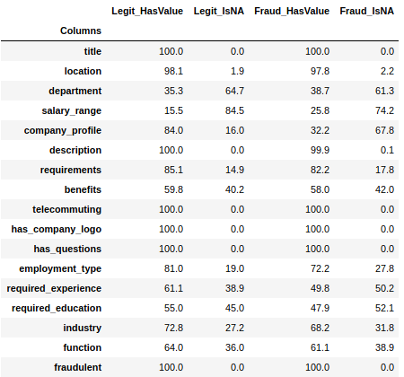
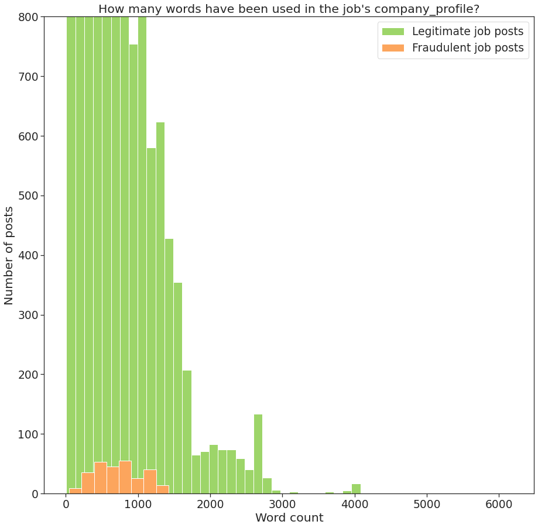
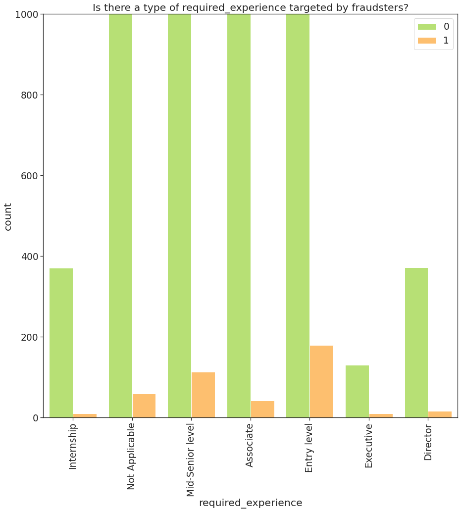
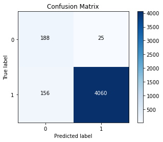
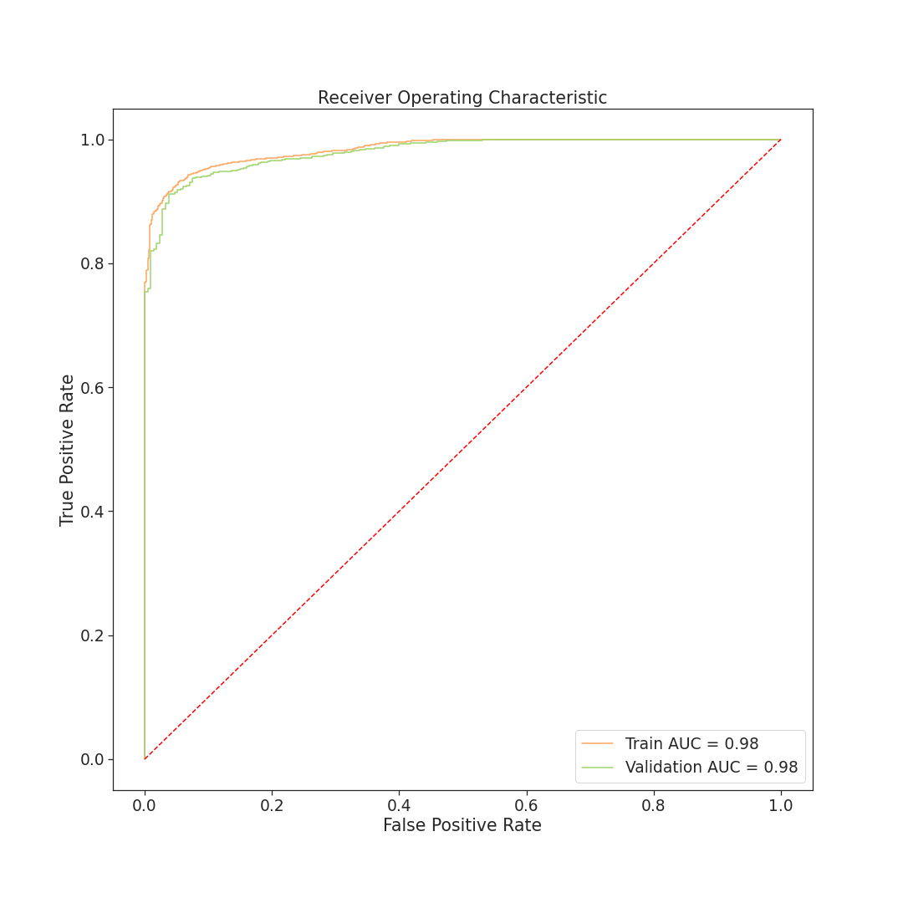

# Online Recruitment Fraud Detection
_Work done by Antoine Ghilissen_
## Github Content
|  File  |  Description  |
|  ---:  |  ---  |
|  [README.md](./README.md)  |  The project in a nutshell  |
|  [EDA](./EDA.ipynb)  |  This file compiles the exploratory data analysis and addresses the problem with an "intuitive" approach. It should be viewed first  |
|  [index](./index.ipynb)  |  The main notebook which leads to a model classifying the available data  |
|  [library](./library.py)  |  Python script containing the various functions used in the notebooks (mainly visualisation functions)  |
|  [presentation](./presentation.pdf)  |  Deck of slides supporting the 16/04/2020 Flatiron School graduation presentation  |
|  [Geocoding](./Geocoding)  |  A WIP notebook. The intention is to standardise the location of the various job posts and see how the location impacts the legitimacy of an ad  |
|  [fake_job_postings](./fake_job_postings.csv)  |  The raw data
|  [img folder](./img)  |  Folder containing the graphs/images  |

## The Data

The dataset used in this project has been sourced from [Kaggle](https://www.kaggle.com/shivamb/real-or-fake-fake-jobposting-prediction) but was created by the Laboratory of Information & Communication Systems Security at the University of the Aegean ([source](http://emscad.samos.aegean.gr/)). Their first publication about this dataset can be found [here](https://www.mdpi.com/1999-5903/9/1/6/htm).

It contains 17,880 job ads posted via the [workable](https://www.workable.com/) platform during 2012 and 2014. These posts have been categorised by an in-house team of specialists into two categories: fraudulent (866 of them) or legitimate (the remaining 17,014).

## The Problem

This dataset was compiled by an Applicant Tracking Service (ATS): [workable](https://www.workable.com/). Workable is a SaaS (software as a service) company that bridges companies willing to hire people and job posting platforms such as Indeed, Monster, GlassDoor, etc.

Although these job ads have been "curated" by the workable platform, about 5% of them are apparently fraudulent. This raises privacy concerns and can lead to reputation damage as well as [monetary impact](https://chicago.cbslocal.com/2020/04/13/scammers-are-targeting-online-job-seekers-amid-coronavirus-crisis/).

Although online recruitment fraud (ORF) shares some similarities with email spamming, online bullying, etc. It is also specific enough to make the counter-measures used against those scams ineffective.

## Preliminary Analysis

One of the first thing to mention is that, the similarities between legitimate and fraudulent job posts make an intuitive approach very difficult. The fraudulent posts will follow the same pattern as the legitimate ones with a few exceptions:
* as shown in the table above, the scammers, although less keen on providing informations, will emphasis the monetary aspect and tend to complete the `salary_range` field more than recruiting companies normally would. `location`, `department` and `function` also have a higher completion rate.
* when providing information, the scammer will use less words. Especially for fields like `company_profile` or `benefits`.

* although all type of education, experience and contracts are affected by fraudulent posts, full-time entry level position with lower levels of education will be more affected.

## Classification as a solution
### Synthetic Minority Oversampling TEchnique
Due to the class imbalance (only 5% of the dataset is fraudulent job ads), the minority class has been augmented using the SMOTE from the [imbalanced-learn library/API](https://imbalanced-learn.readthedocs.io/en/stable/generated/imblearn.over_sampling.SMOTE.html). This allowed our training dataset to have 25,262 datapoints.

Extra features were extracted form the text fields (mainly offers providing external URLs, phone or email contact details) and the Term Frequency / Inverse Document Frequency method was applied on each of the four main text fields: `company_profile`, `description`, `requirements` and `benefits`. The vocabulary has been limited to 5000 words in order to keep the size of these objects manageable.

Different models were considered:
* Gaussian Naive Bayes
* Multinomial Naive Bayes
* Random Forest
* XGBoost

The model preferred is the Multinomial Naive Bayes because of how much faster the training stage is but also because the ROC_AUC score is 0.9957. The Random Forest achieved the maximum score of 1 but no parameters were restricted and it showed some overfiting. The XGBoost achieved a slightly better score than the MNB but it took 10x as much time to train the data.

Once the MNB model was selected, a GridSearchCV was performed to optimised the `alpha` parameter.

The confusion matrix of this selected model is as follow:

We have managed to classify 4248 job posts correctly, 156 are false negatives and 25 are false positive.

Our approach was to minimise the false positive as this scenario could potentially be the most harmful. Putting a fraudulent post claiming it is legitimate could lead to applicants having their identity stolen and be part of [money laundering](https://www.monster.com/inside/money-laundering/inside2.aspx) schemes for example.

False negatives are also bad news as a company willing to hire would see their ads not published but this could be avoided by referring the predicted fraudulent ads to human oversight or add steps to verify the authenticity of the person posting the ad.

Finally, here is the Receiver Operating Characteristic curve for the model, showing the difference in performance between the training dataset and the test dataset. This 'gap' could be reduced by modifying the alpha value but this would mainly reduce the performance on the train dataset without really improving the score of the test dataset.

## Future work

* The slowest step in this modelling is the SMOTE. It required a rather unusual hardware to be able to complete (the objects generated by this step bring the RAM usage up to 45G). Other methods of class balancing could be faster (e.g. [RUS](https://imbalanced-learn.readthedocs.io/en/stable/generated/imblearn.under_sampling.RandomUnderSampler.html)).
* Applying a tf-idf transformation on each of the 4 text fields is also very computer intensive. and add a huge amount of dimension to the dataset (limiting the vocabulary to 5000 means for those columns alone, we have about 360 million values). Aggregating those fields would certainly mean losing granularity but it would also accelerate the process.
* The vocabulary limitation could be improved by refactoring the code and use the pipeline method so a GridSearchCV could find the ideal value for the vocabulary limit.
* A bag of word model could reinforce the intuitive approach and would certainly bring some insight on how fraud posts are phrased and what they insist on.

_Feel free to reach out if you have any questions/recommendations about this project!_