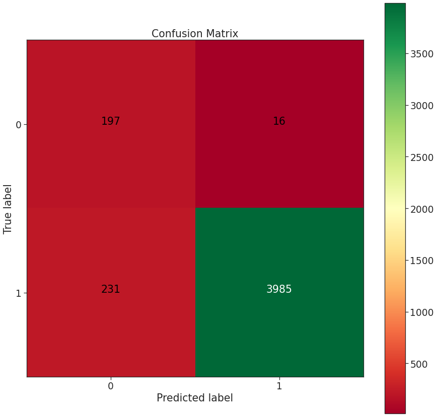

# Online Recruitment Fraud Detection
_Work done by Antoine Ghilissen_

## Github Content
|  File  |  Description  |
|  ---:  |  ---  |
|  [README.md](./README.md)  |  The project in a nutshell  |
|  [presentation](./presentation.pdf)  |  Deck of slides supporting the 16/04/2020 Flatiron School graduation presentation  (numbers have changed since the actual presentation as I kept on working on this project but findings are similar)|
|  [EDA](./EDA.ipynb)  |  This file compiles the exploratory data analysis and addresses the problem with an "intuitive" approach. It should be the first notebook to view  |
|  [index](./index.ipynb)  |  The main notebook which leads to a model classifying the available data  |
|  [data](./data)  |  The raw data |
|  [scripts](./scripts)  |  Folder containing Python scripts with various functions used in the notebooks (mainly visualisation functions)  |
| [models](./models) | Contains `.pkl` files of the various models experimented |
|  [images](./img)  |  Folder containing the graphs/images  |
|  [Geocoding](./Geocoding)  |  A WIP notebook. The intention is to standardise the location of the various job posts and see how the location impacts the legitimacy of an ad  |

---

## Summary
After experimenting with SMOTE and under-sampling to balance the disparity between the fraudulent and genuine job ads, SMOTE was preferred as models tend to over-fit the training data when under-sampling was used.

Various models were tried, but a Multinomial Naive Bayes classifier was preferred as it would minimise the **F**alse **P**ositive **R**ate. The hyper-parameter alpha was then tuned to offer a compromise between the amount of false positives and false negatives. 

The preferred model classifies the test dataset with a **recall = 94.5%** and a **precision = 99.6%**. Over the 4429 job offers in the test data set, only 16 were false positive, whilst 231 were false negatives.
Statistically, 221 job posts from the test dataset are fraudulent (5%). This number comes down to 197(TN) + 16(FP) = 213 if we look at the confusion matrix. Our model has 197 true negatives, that is 92.5%.

## The Data
The dataset used in this project is sourced from [Kaggle](https://www.kaggle.com/shivamb/real-or-fake-fake-jobposting-prediction) but was created by the Laboratory of Information & Communication Systems Security at the University of the Aegean ([source](http://emscad.samos.aegean.gr/)). Their first publication about this dataset is available [here](https://www.mdpi.com/1999-5903/9/1/6/htm).

It contains 17,880 job ads posted via the [workable](https://www.workable.com/) platform during 2012 and 2014. Two categories were used by a team of in-house specialists to classify these posts: fraudulent (866 of them) or legitimate (the remaining 17,014).

## Preliminary Analysis
One of the first things to mention is that the similarities between legitimate and fraudulent job posts make an intuitive approach very difficult. The fraudulent posts will follow the same pattern as the legitimate ones with a few exceptions:
* as shown in the table above, the scammers, although less keen on providing information, will emphasis the monetary aspect and tend to complete the `salary_range` field more than recruiting companies normally would. `location`, `department` and `function` also have a higher completion rate.
* when providing information, the scammers will use fewer words. Especially for fields like `company_profile` or `benefits`.

* although all type of education, experience and contracts are affected by fraudulent posts, full-time entry-level position with lower levels of education will be more affected.

## Classification as a solution
### Synthetic Minority Oversampling TEchnique
Due to the class imbalance (only 5% of the dataset is fraudulent job ads), the SMOTE from the [imbalanced-learn library/API](https://imbalanced-learn.readthedocs.io/en/stable/generated/imblearn.over_sampling.SMOTE.html) was used to synthetically over-sample the minority class. It allowed our training dataset to have 25,262 data points.

Extra features were extracted from the text fields (mainly offers providing external URLs, phone or email contact details) and the Term Frequency / Inverse Document Frequency method was applied on each of the four main text fields: `company_profile`, `description`, `requirements` and `benefits`. The vocabulary has been limited to 5000 words to keep the size of these objects manageable.

Different models were considered:
* Gaussian Naive Bayes
* Multinomial Naive Bayes
* Random Forest
* XGBoost

The model preferred is the Multinomial Naive Bayes. The training stage is much faster than the XGBoost whilst the ROC_AUC score is still as high as 0.9957. The Random Forest achieved the maximum score of 1 but it showed over-fitting and there was no parameter restriction in place. The XGBoost achieved a slightly better score than the MNB. However, it took ten times as much time to train the data.

Once the MNB model was selected, The `alpha` parameter was optimised using GridSearchCV.

The confusion matrix of this selected model is as follow:

We have managed to classify 4248 job posts correctly, 231 are false negatives whilst 16 are false positive.

Our approach was to minimise the false positive as this scenario could potentially be the most harmful. Putting a fraudulent post claiming it is legitimate could lead to applicants having their identity stolen and be part of [money laundering](https://www.monster.com/inside/money-laundering/inside2.aspx) schemes, for example.

False negatives are also bad news as a company willing to hire would see their ads not published although this could be avoided by referring the predicted fraudulent ads to human oversight or add steps to verify the authenticity of the person posting the ad.

Finally, here is the Receiver Operating Characteristic curve for the model, showing the difference in performance between the training dataset and the test dataset. Modifying the alpha value would reduce this 'gap' but, this would result in a reduction of the performance on the training dataset without really improving the score of the test dataset.

## Discussion
If we solely look at the accuracy, our model is 94.5% accurate. Considering a model classifying all job post as genuine would be 95.15% accurate, one might wonder what the point of this model is.

First of all, accuracy is not what is important here. Our model brings confidence. It does identify genuine ads at a similar rate (94.5%) as the "dummy" classifier but where it differentiates itself is by:
* detecting fake job posts correctly 92.5% of the time.
* significantly minimising the threat of an end-user being scammed. Less than 0.36% of fake job ads (16) are classified as genuine although they are a scam. Which is the error with the higher associated cost.

## Future work
* :heavy_check_mark: The slowest step in this modelling is the SMOTE. It required rather unusual hardware to be able to complete (the objects generated by this step bring the RAM usage up to 45G). Other methods of class balancing could be faster (e.g. [RUS](https://imbalanced-learn.readthedocs.io/en/stable/generated/imblearn.under_sampling.RandomUnderSampler.html)). *Under-sampling meant all models were over-fitting massively*
* Applying a tf-idf transformation on each of the four text fields is also very computer-intensive as it adds a tremendous amount of dimension to the dataset (limiting the vocabulary to 5000 means for those columns alone, we have about 360 million values). Aggregating those fields would certainly mean losing granularity. However, it would also accelerate the process.
* :heavy_check_mark: The vocabulary limitation could be improved by re-factoring the code and use the pipeline method so a GridSearchCV could find the ideal value for the vocabulary limit. *GridSearchCV was not necessary, an in-depth analysis was sufficient*
* :heavy_check_mark: A bag of word model could reinforce the intuitive approach and would certainly bring some insight on how fraud posts are phrased and what they insist on. *Did not do a bag of word but did a deeper analysis of the vocabulary*

_Feel free to reach out if you have any questions/recommendations about this project!_